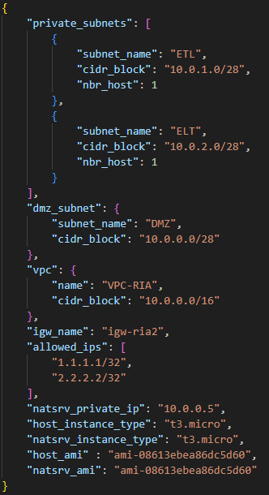

# INFRA-DEPLOY

## Infrastructure schema


The subnets are defined in a JSON file. Here is an example.

# Usage
## Terraform
>*Version used : [v1.10.2](https://releases.hashicorp.com/terraform/1.10.2/)*

1. Configure your AWS in ~/.aws/config & ~/.aws/credentials under a profile named "RIA2"
	1. OR => Change the profile name in terraform/version.tf
2. Create your `terraform.tfvars.json` file (look at the example above)
3. Run the terraform
```
terraform init
terraform apply
```
## Ansible
*As a Windows user, I'm using WSL (Debian 12) to run ansible playbook*
The default configuration is set in `./ansible/ansible.cfg` file.
### Setup
1. Put the admin. ssh key in `~/.ssh/ria2_sysadm` (or adapt in `./ansible/ansible.cfg`)
2. Install roles dependencies
	1. `ansible-galaxy install -f -r requirements.yml --roles-path=./roles`
### Setup the NAT server
```bash
cd ./ansible
ansible-playbook -i ./cluster_hosts.ini natsrv.yml
```
### Setup The docker hosts
```bash
cd ./ansible
ansible-playbook -i ./cluster_hosts.ini docker_host.yml
```